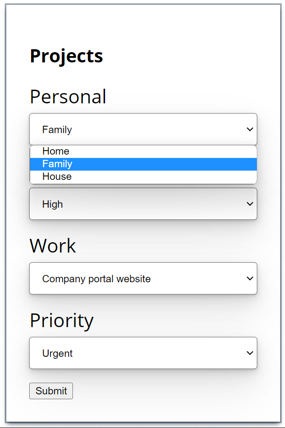
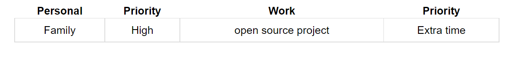

# To do list 
Enter the projects and their proiorities and they will be displayed 

## Authors

- [@h73krishnan](https://github.com/h73krishnan?tab=repositories)

## Tech Stack

**Client:** HTML, CSS, Javascript

## Deployment

https://todolistproj.netlify.app/

## Description

HTML and CSS used to build the form and 
table. The priorities are given as input
and the values are displayed using javascript
DOM manipulation.

## How to use guide
You can click select the which personal project. Then, you could choose the priority as shown in image-1. Then you could press the submit button. 

image-1

When you click on submit the values 
would be displayed

image-2

